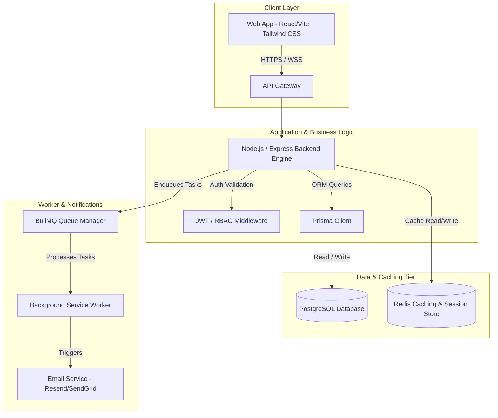
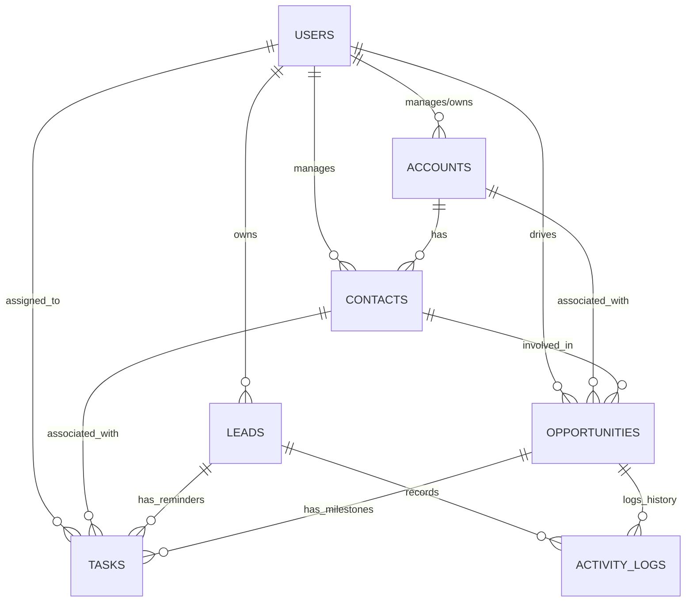

# Phase 1 Functional Requirements Document (FRD)
## Project: Next-Gen AI-Native Glassmorphic CRM
**Version:** 1.0.0  
**Date:** May 30, 2026  
**Status:** Approved for Implementation  
**Target Audience:** Engineering Team, Product Managers, Stakeholders  

---

> [!NOTE]
> This Functional Requirements Document (FRD) outlines the exact requirements, technical architecture, database schemas, and implementation strategy for **Phase 1** of our Customer Relationship Management (CRM) system. 

---

## 1. Executive Summary: What is a CRM?

Before diving into technical specifications, let us define what a CRM is in two distinct layers of depth. This ensures both developers and business owners have a unified understanding of the system's core purpose.

### 1.1 Short & Simple Explanation
A **CRM (Customer Relationship Management)** is a smart digital organizer for businesses. Instead of keeping customer contacts in a phone, sales targets on a whiteboard, and follow-ups in paper notebooks, a CRM pulls everything together into one unified dashboard. It helps a company remember client details, send automated follow-ups, keep track of active sales, and close deals faster.

*   **Real-World Example (Short):**
    Imagine a local mobile store owner. Without a CRM, they write down customer details in a physical notebook. They forget who wanted an iPhone upgrade, duplicate their calls, or lose track of customer warranty complaints. With a CRM, when a customer calls, their profile pops up instantly showing their purchase history (e.g., *bought iPhone 15 last year*), their interest (*wants to trade in for iPhone 17*), and an automatic reminder to call them back next week with a discount code.

### 1.2 Detailed & Comprehensive Explanation
A CRM is an enterprise software platform designed to manage and optimize all interactions a business has with its current prospects, active customers, and past clients across their entire lifecycle. It acts as the single source of truth (SSOT) for the organization’s sales, marketing, and customer support departments.

By collecting data from multiple touchpoints (emails, website forms, phone calls, social media, and chat), the CRM helps businesses build detailed customer profiles, track interest (leads), manage active sales pipelines (opportunities), schedule follow-ups (tasks/reminders), and analyze agent performance.

*   **Real-World Example (Detailed):**
    Consider a premium Real Estate Agency managing 200+ property inquiries monthly.
    *   **Without a CRM:** Inquiries from Google Ads, Facebook, and walk-ins are scattered across Excel sheets. Two different agents call the same lead, offering conflicting prices. A high-value buyer scheduled for a luxury flat viewing is forgotten because the agent lost their sticky note.
    *   **With a CRM:**
        1.  A new inquiry arrives via an online contact form; the CRM instantly creates a **Lead** and assigns it to Agent Priya.
        2.  The CRM labels the lead stage: `Interested -> Visit Scheduled`.
        3.  The system automatically sends a calendar invite and schedules a **Follow-up Task** for Priya: *"Call 2 hours before property visit."*
        4.  Priya marks the visit complete and upgrades the Lead to an **Opportunity** with a value of $500,000 in the sales pipeline.
        5.  The agency Director views a real-time **Sales Pipeline** chart, instantly knowing monthly projected revenue and individual agent close rates.

---

## 2. Project Scope for Phase 1

Phase 1 focuses on building the core foundational database engine, authentication framework, and primary functional modules of the CRM. Advanced features (like AI-driven lead scoring, third-party email syncing, and VoIP dialer integration) are deferred to Phase 2.

### 2.1 Core Pillars of Phase 1
1.  **User & Access Management (RBAC):** Secure authentication for Admins, Sales Managers, and Sales Representatives.
2.  **Lead Management:** Capturing, tracking, and moving potential buyers through a structured status funnel.
3.  **Contact & Account Directory:** Storing absolute customer profiles and linking them to parent companies (Accounts).
4.  **Sales Pipeline (Deals):** Visual Kanban-style flow tracking prospective business deals.
5.  **Task & Follow-up Engine:** Creation of tasks, deadlines, and automated reminder cues.

---

## 3. High-Level Technical Architecture



### 3.1 Tech Stack Selection
| Component | Selected Technology | Rationale |
| :--- | :--- | :--- |
| **Frontend UI** | React.js (TypeScript) + Vite | Dynamic SPA, rapid renders, robust state management via TanStack Query. |
| **Styling** | Custom Vanilla CSS + Tailwind CSS | For the premium glassmorphic UI requested by the user. Custom animations, soft translucent blurs, and strict HSL colors. |
| **Backend API** | Node.js with Express / NestJS | Asynchronous, highly scalable event loop perfect for active real-time data flow. |
| **Database** | PostgreSQL | Enterprise-grade ACID compliance, strict schemas, foreign keys for CRM relational integrity. |
| **ORM** | Prisma ORM | Complete type-safety matching the PostgreSQL tables with TypeScript models. |
| **Caching/Queue** | Redis | Extreme speed (sub-millisecond) for session management, API rate-limiting, and lead dashboard caching. |
| **Background Jobs**| BullMQ | Redis-backed robust background queue for transactional email follow-ups. |
| **Authentication** | JSON Web Tokens (JWT) + Bcrypt | Secured stateless authentication with strict Role-Based Access Control (RBAC). |

---

## 4. Complete Database Architecture & Schema

To establish a solid database, we design a highly relational structure in PostgreSQL. Relationships are strictly enforced using foreign keys and cascading delete rules to avoid orphan records.

### 4.1 Conceptual Entity-Relationship (ER) Diagram



---

### 4.2 Raw PostgreSQL DDL Schema Script
Save this script as `schema.sql` to instantiate the database structure.

```sql
-- Enable UUID extension for secure, non-guessable primary keys
CREATE EXTENSION IF NOT EXISTS "uuid-ossp";

-- 1. Create custom types/enums
CREATE TYPE user_role AS ENUM ('ADMIN', 'SALES_MANAGER', 'SALES_REP');
CREATE TYPE lead_status AS ENUM ('NEW', 'CONTACTED', 'QUALIFIED', 'PROPOSAL_SENT', 'UNQUALIFIED', 'LOST');
CREATE TYPE lead_source AS ENUM ('WEBSITE', 'COLD_CALL', 'REFERRAL', 'LINKEDIN', 'EMAIL_CAMPAIGN', 'OTHER');
CREATE TYPE opportunity_stage AS ENUM ('DISCOVERY', 'QUALIFICATION', 'PROPOSAL', 'NEGOTIATION', 'CLOSED_WON', 'CLOSED_LOST');
CREATE TYPE priority_level AS ENUM ('LOW', 'MEDIUM', 'HIGH', 'CRITICAL');
CREATE TYPE task_status AS ENUM ('PENDING', 'IN_PROGRESS', 'COMPLETED', 'OVERDUE');
CREATE TYPE activity_type AS ENUM ('CALL', 'EMAIL', 'MEETING', 'NOTE', 'SYSTEM_UPDATE');

-- 2. Create Users Table
CREATE TABLE users (
    id UUID PRIMARY KEY DEFAULT uuid_generate_v4(),
    email VARCHAR(255) UNIQUE NOT NULL,
    password_hash VARCHAR(255) NOT NULL,
    first_name VARCHAR(100) NOT NULL,
    last_name VARCHAR(100) NOT NULL,
    role user_role DEFAULT 'SALES_REP' NOT NULL,
    is_active BOOLEAN DEFAULT TRUE NOT NULL,
    created_at TIMESTAMP WITH TIME ZONE DEFAULT CURRENT_TIMESTAMP NOT NULL,
    updated_at TIMESTAMP WITH TIME ZONE DEFAULT CURRENT_TIMESTAMP NOT NULL
);

-- 3. Create Accounts Table (Organizations / B2B clients)
CREATE TABLE accounts (
    id UUID PRIMARY KEY DEFAULT uuid_generate_v4(),
    name VARCHAR(255) NOT NULL,
    industry VARCHAR(100),
    website VARCHAR(255),
    phone VARCHAR(50),
    billing_address TEXT,
    shipping_address TEXT,
    owner_id UUID REFERENCES users(id) ON DELETE SET NULL,
    created_at TIMESTAMP WITH TIME ZONE DEFAULT CURRENT_TIMESTAMP NOT NULL,
    updated_at TIMESTAMP WITH TIME ZONE DEFAULT CURRENT_TIMESTAMP NOT NULL
);

-- 4. Create Contacts Table (Individual stakeholders inside Accounts)
CREATE TABLE contacts (
    id UUID PRIMARY KEY DEFAULT uuid_generate_v4(),
    account_id UUID REFERENCES accounts(id) ON DELETE SET NULL,
    first_name VARCHAR(100) NOT NULL,
    last_name VARCHAR(100) NOT NULL,
    email VARCHAR(255) UNIQUE,
    phone VARCHAR(50),
    job_title VARCHAR(100),
    owner_id UUID REFERENCES users(id) ON DELETE SET NULL,
    created_at TIMESTAMP WITH TIME ZONE DEFAULT CURRENT_TIMESTAMP NOT NULL,
    updated_at TIMESTAMP WITH TIME ZONE DEFAULT CURRENT_TIMESTAMP NOT NULL
);

-- 5. Create Leads Table (Unqualified prospects)
CREATE TABLE leads (
    id UUID PRIMARY KEY DEFAULT uuid_generate_v4(),
    first_name VARCHAR(100) NOT NULL,
    last_name VARCHAR(100) NOT NULL,
    email VARCHAR(255) UNIQUE NOT NULL,
    phone VARCHAR(50),
    company_name VARCHAR(255),
    status lead_status DEFAULT 'NEW' NOT NULL,
    source lead_source DEFAULT 'OTHER' NOT NULL,
    estimated_value DECIMAL(12, 2) DEFAULT 0.00 NOT NULL,
    owner_id UUID REFERENCES users(id) ON DELETE SET NULL,
    notes TEXT,
    created_at TIMESTAMP WITH TIME ZONE DEFAULT CURRENT_TIMESTAMP NOT NULL,
    updated_at TIMESTAMP WITH TIME ZONE DEFAULT CURRENT_TIMESTAMP NOT NULL
);

-- 6. Create Opportunities Table (Qualified sales/deals in the pipeline)
CREATE TABLE opportunities (
    id UUID PRIMARY KEY DEFAULT uuid_generate_v4(),
    name VARCHAR(255) NOT NULL,
    account_id UUID REFERENCES accounts(id) ON DELETE CASCADE,
    contact_id UUID REFERENCES contacts(id) ON DELETE SET NULL,
    stage opportunity_stage DEFAULT 'DISCOVERY' NOT NULL,
    amount DECIMAL(15, 2) NOT NULL DEFAULT 0.00,
    probability INT CHECK (probability >= 0 AND probability <= 100) DEFAULT 10 NOT NULL,
    close_date DATE,
    owner_id UUID REFERENCES users(id) ON DELETE SET NULL,
    created_at TIMESTAMP WITH TIME ZONE DEFAULT CURRENT_TIMESTAMP NOT NULL,
    updated_at TIMESTAMP WITH TIME ZONE DEFAULT CURRENT_TIMESTAMP NOT NULL
);

-- 7. Create Tasks Table (Follow-ups & Reminders)
CREATE TABLE tasks (
    id UUID PRIMARY KEY DEFAULT uuid_generate_v4(),
    title VARCHAR(255) NOT NULL,
    description TEXT,
    due_date TIMESTAMP WITH TIME ZONE NOT NULL,
    status task_status DEFAULT 'PENDING' NOT NULL,
    priority priority_level DEFAULT 'MEDIUM' NOT NULL,
    assigned_to_id UUID REFERENCES users(id) ON DELETE SET NULL,
    lead_id UUID REFERENCES leads(id) ON DELETE CASCADE,
    contact_id UUID REFERENCES contacts(id) ON DELETE CASCADE,
    opportunity_id UUID REFERENCES opportunities(id) ON DELETE CASCADE,
    created_at TIMESTAMP WITH TIME ZONE DEFAULT CURRENT_TIMESTAMP NOT NULL,
    updated_at TIMESTAMP WITH TIME ZONE DEFAULT CURRENT_TIMESTAMP NOT NULL,
    CONSTRAINT task_target_check CHECK (
        (lead_id IS NOT NULL)::INT + 
        (contact_id IS NOT NULL)::INT + 
        (opportunity_id IS NOT NULL)::INT = 1
    ) -- Guarantees that a task is linked to EXACTLY one lead, contact, or opportunity
);

-- 8. Create Activity Logs Table (Timeline audits for customer interactions)
CREATE TABLE activity_logs (
    id UUID PRIMARY KEY DEFAULT uuid_generate_v4(),
    type activity_type DEFAULT 'NOTE' NOT NULL,
    description TEXT NOT NULL,
    performed_by_id UUID REFERENCES users(id) ON DELETE SET NULL,
    lead_id UUID REFERENCES leads(id) ON DELETE CASCADE,
    contact_id UUID REFERENCES contacts(id) ON DELETE CASCADE,
    opportunity_id UUID REFERENCES opportunities(id) ON DELETE CASCADE,
    created_at TIMESTAMP WITH TIME ZONE DEFAULT CURRENT_TIMESTAMP NOT NULL,
    CONSTRAINT log_target_check CHECK (
        (lead_id IS NOT NULL)::INT + 
        (contact_id IS NOT NULL)::INT + 
        (opportunity_id IS NOT NULL)::INT >= 1
    ) -- Guarantees that an activity log is tied to at least one entity
);

-- 9. Create Database Indexes for High-Performance Queries
CREATE INDEX idx_users_email ON users(email);
CREATE INDEX idx_accounts_owner ON accounts(owner_id);
CREATE INDEX idx_contacts_account ON contacts(account_id);
CREATE INDEX idx_contacts_email ON contacts(email);
CREATE INDEX idx_leads_owner ON leads(owner_id);
CREATE INDEX idx_leads_status ON leads(status);
CREATE INDEX idx_opportunities_stage ON opportunities(stage);
CREATE INDEX idx_opportunities_owner ON opportunities(owner_id);
CREATE INDEX idx_tasks_due_date ON tasks(due_date);
CREATE INDEX idx_tasks_assigned_to ON tasks(assigned_to_id);
CREATE INDEX idx_activity_logs_lead ON activity_logs(lead_id);
CREATE INDEX idx_activity_logs_opportunity ON activity_logs(opportunity_id);
```

---

### 4.3 Equivalent Prisma Schema (`schema.prisma`)
This schema matches standard Next.js / NestJS web application setups.

```prisma
datasource db {
  provider = "postgresql"
  url      = env("DATABASE_URL")
}

generator client {
  provider = "prisma-client-js"
}

enum Role {
  ADMIN
  SALES_MANAGER
  SALES_REP
}

enum LeadStatus {
  NEW
  CONTACTED
  QUALIFIED
  PROPOSAL_SENT
  UNQUALIFIED
  LOST
}

enum LeadSource {
  WEBSITE
  COLD_CALL
  REFERRAL
  LINKEDIN
  EMAIL_CAMPAIGN
  OTHER
}

enum Stage {
  DISCOVERY
  QUALIFICATION
  PROPOSAL
  NEGOTIATION
  CLOSED_WON
  CLOSED_LOST
}

enum Priority {
  LOW
  MEDIUM
  HIGH
  CRITICAL
}

enum TaskStatus {
  PENDING
  IN_PROGRESS
  COMPLETED
  OVERDUE
}

enum ActivityType {
  CALL
  EMAIL
  MEETING
  NOTE
  SYSTEM_UPDATE
}

model User {
  id            String          @id @default(uuid()) @db.Uuid
  email         String          @unique
  passwordHash  String
  firstName     String
  lastName      String
  role          Role            @default(SALES_REP)
  isActive      Boolean         @default(true)
  createdAt     DateTime        @default(now())
  updatedAt     DateTime        @updatedAt
  accounts      Account[]
  contacts      Contact[]
  leads         Lead[]
  opportunities Opportunity[]
  tasks         Task[]
  activities    ActivityLog[]

  @@map("users")
}

model Account {
  id              String         @id @default(uuid()) @db.Uuid
  name            String
  industry        String?
  website         String?
  phone           String?
  billingAddress  String?
  shippingAddress String?
  ownerId         String?        @db.Uuid
  owner           User?          @relation(fields: [ownerId], references: [id], onDelete: SetNull)
  contacts        Contact[]
  opportunities   Opportunity[]
  createdAt       DateTime       @default(now())
  updatedAt       DateTime       @updatedAt

  @@map("accounts")
}

model Contact {
  id            String         @id @default(uuid()) @db.Uuid
  accountId     String?        @db.Uuid
  account       Account?       @relation(fields: [accountId], references: [id], onDelete: SetNull)
  firstName     String
  lastName      String
  email         String?        @unique
  phone         String?
  jobTitle      String?
  ownerId       String?        @db.Uuid
  owner         User?          @relation(fields: [ownerId], references: [id], onDelete: SetNull)
  opportunities Opportunity[]
  tasks         Task[]
  activities    ActivityLog[]
  createdAt       DateTime       @default(now())
  updatedAt       DateTime       @updatedAt

  @@map("contacts")
}

model Lead {
  id             String         @id @default(uuid()) @db.Uuid
  firstName      String
  lastName       String
  email          String         @unique
  phone          String?
  companyName    String?
  status         LeadStatus     @default(NEW)
  source         LeadSource     @default(OTHER)
  estimatedValue Decimal        @default(0.00) @db.Decimal(12, 2)
  ownerId        String?        @db.Uuid
  owner          User?          @relation(fields: [ownerId], references: [id], onDelete: SetNull)
  notes          String?
  tasks          Task[]
  activities     ActivityLog[]
  createdAt      DateTime       @default(now())
  updatedAt      DateTime       @updatedAt

  @@map("leads")
}

model Opportunity {
  id            String         @id @default(uuid()) @db.Uuid
  name          String
  accountId     String         @db.Uuid
  account       Account        @relation(fields: [accountId], references: [id], onDelete: Cascade)
  contactId     String?        @db.Uuid
  contact       Contact?       @relation(fields: [contactId], references: [id], onDelete: SetNull)
  stage         Stage          @default(DISCOVERY)
  amount        Decimal        @default(0.00) @db.Decimal(15, 2)
  probability   Int            @default(10)
  closeDate     DateTime?
  ownerId       String?        @db.Uuid
  owner         User?          @relation(fields: [ownerId], references: [id], onDelete: SetNull)
  tasks         Task[]
  activities    ActivityLog[]
  createdAt     DateTime       @default(now())
  updatedAt     DateTime       @updatedAt

  @@map("opportunities")
}

model Task {
  id             String         @id @default(uuid()) @db.Uuid
  title          String
  description    String?
  dueDate        DateTime
  status         TaskStatus     @default(PENDING)
  priority       Priority       @default(MEDIUM)
  assignedToId   String?        @db.Uuid
  assignedTo     User?          @relation(fields: [assignedToId], references: [id], onDelete: SetNull)
  leadId         String?        @db.Uuid
  lead           Lead?          @relation(fields: [leadId], references: [id], onDelete: Cascade)
  contactId      String?        @db.Uuid
  contact        Contact?       @relation(fields: [contactId], references: [id], onDelete: Cascade)
  opportunityId  String?        @db.Uuid
  opportunity    Opportunity?   @relation(fields: [opportunityId], references: [id], onDelete: Cascade)
  createdAt      DateTime       @default(now())
  updatedAt      DateTime       @updatedAt

  @@map("tasks")
}

model ActivityLog {
  id             String         @id @default(uuid()) @db.Uuid
  type           ActivityType   @default(NOTE)
  description    String
  performedById  String?        @db.Uuid
  performedBy    User?          @relation(fields: [performedById], references: [id], onDelete: SetNull)
  leadId         String?        @db.Uuid
  lead           Lead?          @relation(fields: [leadId], references: [id], onDelete: Cascade)
  contactId      String?        @db.Uuid
  contact        Contact?       @relation(fields: [contactId], references: [id], onDelete: Cascade)
  opportunityId  String?        @db.Uuid
  opportunity    Opportunity?   @relation(fields: [opportunityId], references: [id], onDelete: Cascade)
  createdAt      DateTime       @default(now())

  @@map("activity_logs")
}
```

---

## 5. Load, Performance, & Database Caching Strategy

An enterprise CRM can experience heavy database read traffic (rendering reports, loading dashboards, search indexing) combined with steady write traffic. To prevent slow performance, we implement a robust optimization strategy.

### 5.1 Connection Pooling
*   **Problem:** Postgres spawns a process for every client connection. At high traffic or when running backend serverless routes (like Vercel/NextJS), connection counts can exceed safe memory limits.
*   **Solution:** Implement **PgBouncer** in transaction pooling mode. Maintain a persistent pool of 20 database connections that can serve up to 5,000 concurrent client queries asynchronously.

### 5.2 Redis Caching Infrastructure
We introduce an in-memory caching tier between Node.js and PostgreSQL to store hot data.

```
                  ┌───────────────────────┐
                  │    Node.js Backend    │
                  └──────────┬────────────┘
                             │
            ┌────────────────┴────────────────┐
            ▼                                 ▼
      [Cache Hit]                       [Cache Miss]
┌───────────────────────┐         ┌───────────────────────┐
│     Redis Cache       │         │   PostgreSQL DB       │
│  (Data returned <1ms) │         │ (Data returned 50ms)  │
└───────────────────────┘         └───────────┬───────────┘
                                              │
                                              ▼
                                   [Save results in Cache]
```

*   **Caching Dashboards:** Compute metrics (total sales, count of new leads) every 15 minutes. Cache the resulting JSON block in Redis with an absolute expiration time of `900 seconds`.
*   **Lead Search Cache:** Cache pagination requests on the main Lead directory list for 2 minutes. Invalidate this cache whenever a `lead_status` is updated or a new Lead is created (`Cache Eviction on Write`).

### 5.3 Write Optimization & Indexes
To ensure fast reads, we index columns frequently used in filtering:
*   `leads(email)` and `contacts(email)`: Speeds up lookup during automated API imports.
*   `tasks(due_date)`: Resolves performance bottlenecks on morning agenda queries.
*   `leads(status)`: Optimizes dashboard summary counting logic.

---

## 6. Functional Specifications & User Stories

### 6.1 Module A: Authentication & User Roles (RBAC)
*   **Description:** Limits CRM data access based on defined organizational positions.
*   **Roles:**
    *   `ADMIN`: Full delete capabilities, user creation, global dashboard visibility.
    *   `SALES_MANAGER`: Access to all lead activities, pipeline reviews, performance metrics, but cannot delete records or users.
    *   `SALES_REP`: Can only view and edit their own assigned leads, contacts, opportunities, and tasks.

> [!IMPORTANT]
> **User Story:**
> *As a Sales Rep,* I want to log into the CRM using my corporate email and password securely, *so that* I can access my active dashboard containing my leads and avoid seeing other reps' private conversations.

---

### 6.2 Module B: Lead Pipeline & Status Flow
*   **Description:** Translates passive inquiries into potential revenue. Leads move along the pipeline:
    `NEW` $\rightarrow$ `CONTACTED` $\rightarrow$ `QUALIFIED` $\rightarrow$ `PROPOSAL_SENT` $\rightarrow$ `UNQUALIFIED` / `LOST`.
*   **Conversion Trigger:** Once a lead is changed to `QUALIFIED`, the CRM will run a trigger to:
    1.  Create an **Account** (using the Company Name field).
    2.  Create a **Contact** (using First/Last Name, Email, and Phone fields).
    3.  Optionally create an **Opportunity** (prefilled with the Estimated Value).

> [!IMPORTANT]
> **User Story:**
> *As a Sales Rep,* I want to transition a Lead from 'NEW' to 'CONTACTED' after my initial discovery call, *so that* my Sales Manager knows that active follow-up is underway.

---

### 6.3 Module C: Visual Sales Pipeline (Kanban Deals)
*   **Description:** A drag-and-drop interactive UI displaying sales opportunities as visual cards sorted by deal progression stages.
*   **Probability Integration:** Every stage carries a weight ($10\%$ to $90\%$). The CRM dynamically calculates estimated monthly closed-won revenue:
    $$\text{Weighted Revenue} = \text{Amount} \times \text{Probability}$$

---

### 6.4 Module D: Reminders & Tasks Engine
*   **Description:** The action center of the CRM. Tasks alert agents on actions they must perform immediately.
*   **Automation:** When a lead status transitions to `PROPOSAL_SENT`, the engine automatically fires a background task in BullMQ to create an active follow-up task: *"Call to request feedback on sent contract"* due exactly 48 hours later.

---

## 7. RESTful API Blueprint (JSON Payloads)

### 7.1 Create a New Lead (`POST /api/v1/leads`)
*   **Headers:** `Authorization: Bearer <JWT_TOKEN>`

#### Request Payload
```json
{
  "firstName": "Amit",
  "lastName": "Mehta",
  "email": "amit.mehta@corp.in",
  "phone": "+91 98989 12345",
  "companyName": "Mehta Logistics",
  "source": "WEBSITE",
  "estimatedValue": 75000.00,
  "notes": "Interested in premium software integration package for his enterprise logistics firm."
}
```

#### Response Payload (`201 Created`)
```json
{
  "status": "success",
  "data": {
    "id": "e6a0d421-2ef3-40e1-b4f0-4df2f2e5a4de",
    "firstName": "Amit",
    "lastName": "Mehta",
    "email": "amit.mehta@corp.in",
    "phone": "+91 98989 12345",
    "companyName": "Mehta Logistics",
    "status": "NEW",
    "source": "WEBSITE",
    "estimatedValue": "75000.00",
    "ownerId": "77f3e82d-45c1-4b1f-aa33-cf510b64d1f2",
    "notes": "Interested in premium software integration package for his enterprise logistics firm.",
    "createdAt": "2026-05-30T12:45:00.000Z",
    "updatedAt": "2026-05-30T12:45:00.000Z"
  }
}
```

---

### 7.2 Update Lead Status / Trigger Conversion (`PATCH /api/v1/leads/:id`)
*   **URL Parameter:** `id = e6a0d421-2ef3-40e1-b4f0-4df2f2e5a4de`

#### Request Payload (Status Conversion)
```json
{
  "status": "QUALIFIED"
}
```

#### Response Payload (`200 OK`)
```json
{
  "status": "success",
  "message": "Lead converted to client entities successfully.",
  "data": {
    "leadId": "e6a0d421-2ef3-40e1-b4f0-4df2f2e5a4de",
    "conversion": {
      "accountId": "a34bfd21-f09b-449e-b9b1-213c49e29a99",
      "contactId": "c71bf9a8-e1c2-482a-9e12-32aef12d0912",
      "opportunityId": "098d1a2f-3cf4-41da-ab7b-d2c12abde411"
    }
  }
}
```

---

## 8. Premium Glassmorphic User Interface Concept

To achieve a modern and high-end aesthetic, the interface avoids standard layouts in favor of a translucent, ambient dashboard.

### 8.1 UI Design Guidelines
*   **Base Styling Theme:** Dark mode as default.
*   **Colors:** Soft HSL blues, neon teal gradients for success markers, and glowing accent highlights.
*   **Glassmorphic Container:**
    ```css
    .glass-card {
        background: rgba(26, 26, 26, 0.45);
        backdrop-filter: blur(16px) saturate(180%);
        -webkit-backdrop-filter: blur(16px) saturate(180%);
        border: 1px solid rgba(255, 255, 255, 0.08);
        border-radius: 16px;
        box-shadow: 0 8px 32px 0 rgba(0, 0, 0, 0.37);
    }
    ```
*   **Interactions:** Micro-scaling on hover, glow shadows on active buttons, and dynamic dashboard transitions.

---

## 9. Security, Compliance, & Non-Functional Requirements

### 9.1 Data Protection & Security Controls
*   **Password Hashing:** Passwords must be hashed using `Bcrypt` with a salt cost factor of `12`.
*   **Transport Security:** Forced `HTTPS` transport utilizing TLS 1.3 across all endpoints.
*   **SQL Injection Prevention:** Enforced parameterization in all database interactions through Prisma's typed compiler queries.
*   **Input Sanitization:** Standard express-validator routes handling input formatting before parsing queries to the DB engine.

### 9.2 Audits & Monitoring
*   **Daily Backups:** Point-in-Time Recovery (PITR) backups run nightly in PostgreSQL.
*   **Log Preservation:** Transaction logs are retained in encrypted S3 compartments for a minimum of 90 days.
